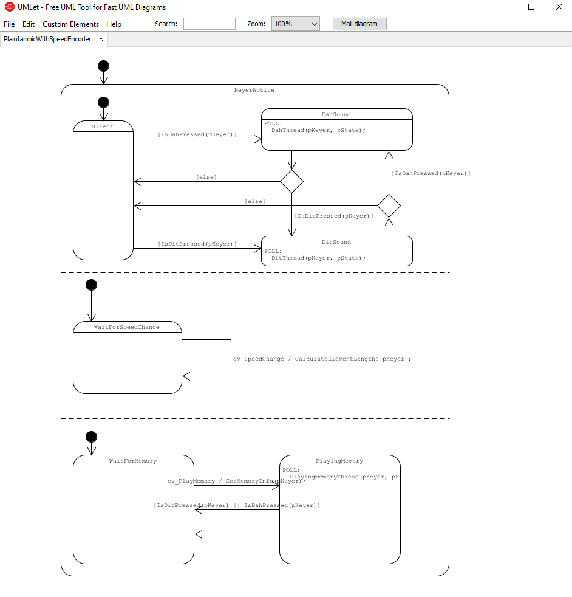
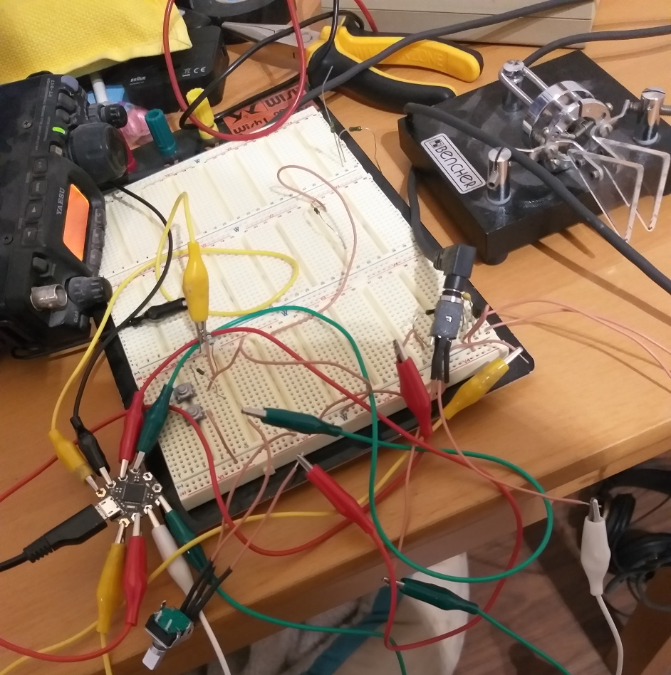
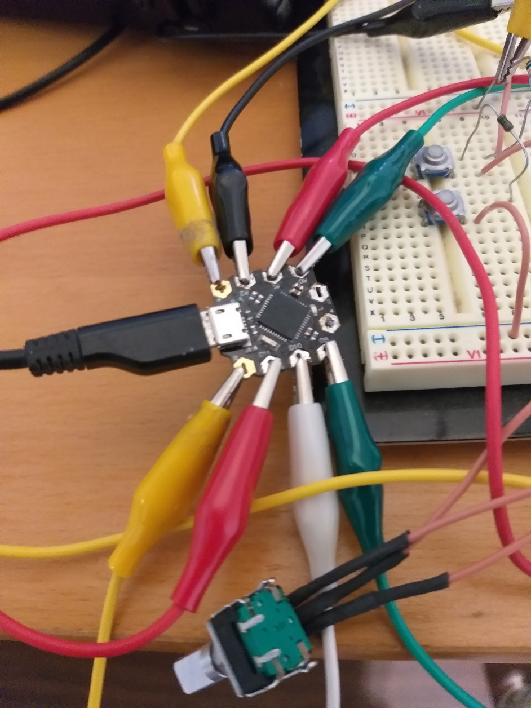

# Keyer

A plain imambic cw keyer (without dit and dot memory)  with a rotary decoder for setting  speed and four predefined memories (2 buttons, detecting press and hold, using only one ADC pin).

Using  [Oosmos](https://github.com/oosmos/oosmos)  with orthogonal states and events. 

Using [Beetle](https://www.dfrobot.com/product-1075.html) as arduino board.

Using [Visual Studio Code](https://code.visualstudio.com/) with the [PlatformIO](https://platformio.org/) extension as development platform.

